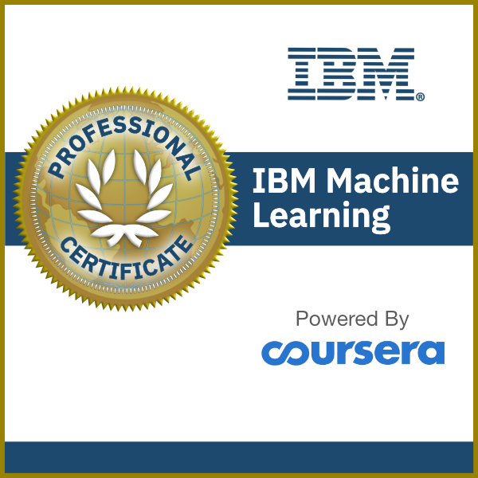

# IBM Machine Learning Professional Certificate

This is my repository to follow up all the courses from Coursera IBM Machine Learning Professional Certificate.

Here I will post the notebooks with my notes throughout the courses.

**To access the notebooks [click here](https://nbviewer.jupyter.org/github/Raoni-Silva/IBM_MachineLearning/tree/main/).** 

## **PROFESSIONAL CERITICATE**
* 01 - Exploratory Data Analysis for Machine Learning **(IN PROGRESS)**
* 02 - Supervised Machine Learning: Regression
* 03 - Supervised Machine Learning: Classification
* 04 - Unsupervised Machine Learning
* 05 - Deep Learning and Reinforcement Learning
* 06 - Specialized Models: Time Series and Survival Analysis

## **INSTRUCTORS**
* **Mark J. Grover**
    * Digital Content Delivery Lead
* **Miguel Maldonado**
    * Machine Learning Curriculum Developer

